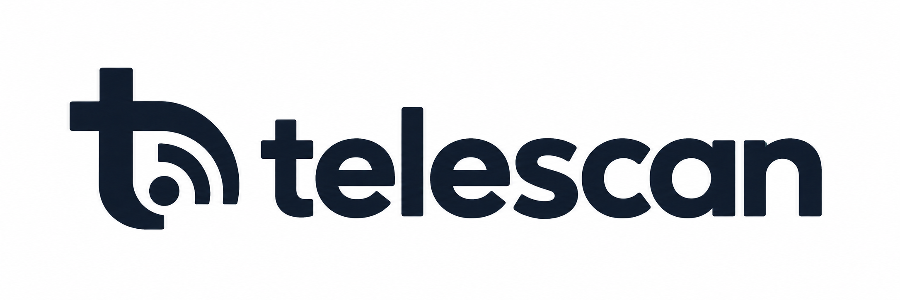

  

# TODOs

## Public preview blockers

- [ ] Downgrade every unresolved catalog control to a `manual` check, or verify
      its setting and behavior from vendor documentation or upstream source.
  - Android Studio: verify `hasOptedIn` and `analytics.settings`.
  - Insomnia: verify `enableAnalytics` and its storage location.
  - Salesforce CLI: verify current and legacy environment variables, persistent
    configuration, accepted values, and precedence.
  - Review the other entries marked `Unresolved` in
    `docs/telemetry-audit-2026-09-08.md`.
- [ ] Add catalog provenance fields and expose them in table, Markdown, and JSON
      output:
  - `verification`: `confirmed`, `qualified`, or `unresolved`
  - `verified_at`
  - telemetry `scope`
  - applicable version range
  - primary evidence URLs
- [ ] Make the README's claims match the evidence. Avoid promising an “exact
      switch” or “real state” for qualified and unresolved entries.
- [ ] Resolve conflicting settings conservatively. Until application-specific
      precedence is modeled, return `UNKNOWN` instead of allowing a lower-
      precedence opt-out to establish `OFF`.
- [ ] Handle version-specific controls:
  - AWS CDK CLI telemetry applies to 2.1100.0 and later.
  - Cordova telemetry differs before and after CLI 13.
  - Prisma 6 and Prisma 8 use different controls.
  - Audit other entries whose flags or behavior changed between major versions.
- [ ] Commit the telemetry audit, catalog corrections, scanner changes, and
      regression tests as a reviewable change.

## Release engineering

- [ ] Release the first public version as `0.1.0` or `0.9.0`, not `1.0.0`,
      while catalog confidence, precedence, and version handling remain
      incomplete.
- [ ] Use one source of truth for the version instead of duplicating it in
      `pyproject.toml` and `telescan/cli.py`.
- [ ] Add a packaging CI job:
  1. Run `python -m build`.
  2. Run `twine check dist/*`.
  3. Install the wheel in a clean environment.
  4. From outside the checkout, run `telescan --version`,
     `telescan validate`, and a basic scan.
- [ ] Confirm that the wheel and source distribution contain
      `data/app.schema.json` and every `data/apps.d/*.json` entry.
- [ ] Add project URLs, author or maintainer information, and issue-tracker
      metadata to `pyproject.toml`.
- [ ] Decide which public name or handle should appear in the MIT copyright
      notice.

## Open-source project files

- [ ] Add `CONTRIBUTING.md` describing catalog structure, tests, and evidence
      requirements for telemetry claims.
- [ ] Add `SECURITY.md` with a private vulnerability-reporting route.
- [ ] Add a pull-request template requiring:
  - vendor documentation or upstream source
  - applicable versions and platforms
  - telemetry scope
  - test fixtures for every added or changed check
- [ ] Add a changelog or documented release-note process.
- [ ] Document the policy for accepting, qualifying, and periodically
      re-verifying catalog entries.

## Scanner and CLI improvements

- [ ] Reject unknown IDs passed to `telescan scan` instead of succeeding with
      zero results.
- [ ] Restrict `--platform` to `linux`, `macos`, and `windows`.
- [ ] Validate category names and report useful suggestions for typos.
- [ ] Display verification status, scope, audit date, and applicable versions
      in `telescan show`.
- [ ] Add fixtures for supported operating systems and real application config
      layouts, especially precedence and multi-profile cases.
- [ ] Keep `UNKNOWN` as the default whenever a setting is unreadable,
      contradictory, version-dependent, or unsupported by sufficient evidence.

## Catalog maintenance

- [ ] Add automated documentation-link checking.
- [ ] Establish a recurring review schedule for stale `verified_at` dates.
- [ ] Keep these scopes distinct in catalog descriptions and verdicts:
  - usage analytics
  - crash and error reporting
  - update and security checks
  - AI training and retention controls
  - required operational service data
  - plugins and extensions
- [ ] Never infer “no telemetry” solely because no documented opt-out was found.
- [ ] Add network or execution-level verification for high-risk entries where
      documentation and stored preferences cannot establish effective consent.

## Public release criteria

- [ ] All unresolved automatic checks are verified or manual.
- [ ] Conflicting sources cannot produce a false `OFF`.
- [ ] Version-specific entries cannot silently apply to unsupported versions.
- [ ] Catalog confidence and scope are visible to users.
- [ ] Unit tests, catalog validation, and clean wheel installation pass in CI
      on Linux, macOS, and Windows.
- [ ] The README positions the release accurately as a preview until the
      stronger `1.0` guarantees are met.
